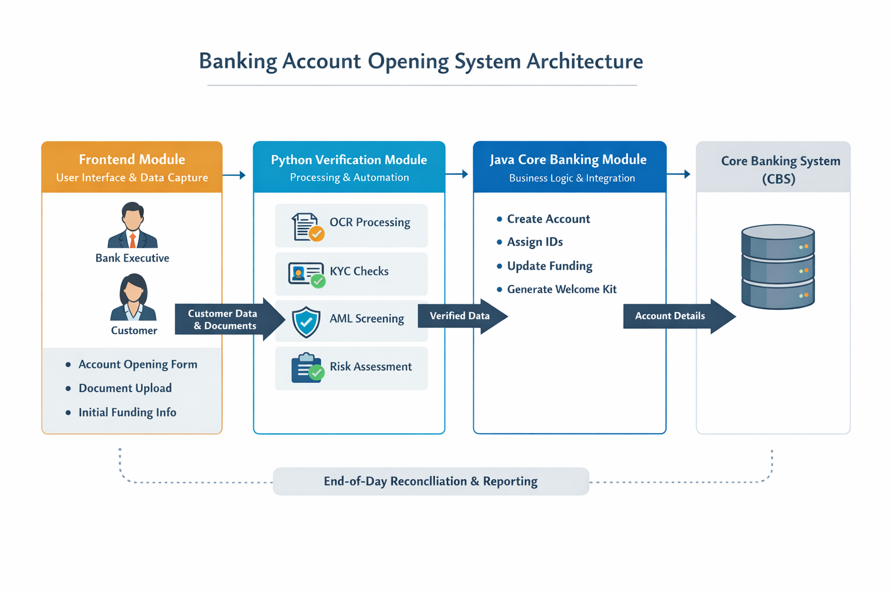

# System Architecture

## Overview

The Banking Account Opening System follows a **modular architecture** that integrates three major components:

1. Frontend Module (User Interface & Data Capture)
2. Python Module (Verification, Processing & Automation)
3. Java Module (Core Business Logic & CBS Integration)

Each module communicates with the other to automate the complete **bank account opening workflow**, from customer data collection to account creation in the Core Banking System (CBS).

---

## Architecture Diagram

---

## Module Description

### 1. Frontend Module (User Interface & Data Capture)

This module provides the interface for **Bank Executives and Customers** to enter account opening details.

Functions:

* Account type selection (Savings / Current)
* Digital Account Opening Form
* Customer information capture
* Nominee details entry
* Banking service registration (Netbanking / Mobile / SMS)
* Initial funding information
* Document upload (Aadhar, PAN, Driving License, Ration Card)

Technologies Used:

* HTML
* CSS
* JavaScript
* React
---

### 2. Python Module (Verification, Processing & Automation)

This module automates document processing and verification.

Functions:

* OCR-based document text extraction
* KYC verification (Aadhar and PAN validation)
* AML screening and negative list checks
* Risk scoring on funding source
* Automated digital welcome kit generation
* End-of-Day (EOD) reconciliation scripts

Technologies Used:

* Python
* OCR libraries
* Automation scripts

---

### 3. Java Module (Core Business Logic & CBS Integration)

This module integrates with the **Core Banking System (CBS)** and performs business operations.

Functions:

* Customer data processing
* Account creation in CBS
* Generation of Customer ID and Account ID
* Nominee registration
* Initial funding transaction processing
* Triggering downstream services such as debit card, passbook, and cheque book issuance

Technologies Used:

* Java
* Database connectivity
* CBS integration APIs

---

## Data Flow

1. Customer fills the digital account opening form via the Frontend.
2. Documents are uploaded and sent to the Python verification module.
3. Python module performs OCR, KYC checks, and risk validation.
4. Verified data is forwarded to the Java module.
5. Java module creates the account in the Core Banking System.
6. Welcome kit and banking services are activated for the customer.

